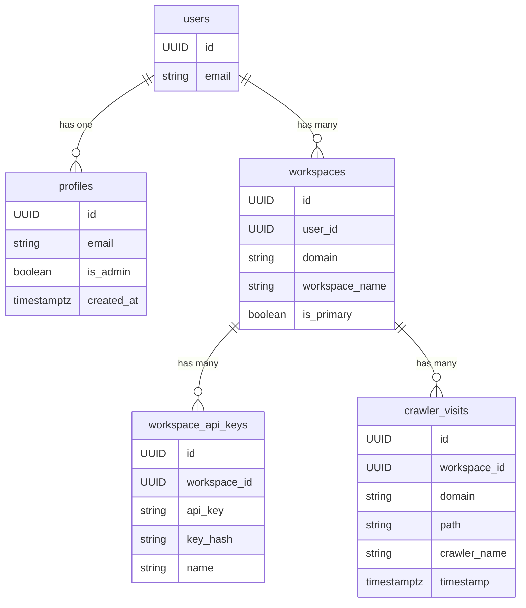

# Data Models

This document describes the data models for the core tables in the application.

## Entity-Relationship Diagram (ERD)

## Table Descriptions

### `users` (from `auth` schema)

This table is managed by Supabase Auth and contains the core user authentication information.

| Column | Data Type | Description |
|---|---|---|
| `id` | `UUID` | **Primary Key.** The unique identifier for the user, from `auth.users`. |
| `email` | `string` | The user's email address. |

### `profiles`

This table stores public user profile data that is safe to expose to the client.

| Column | Data Type | Description |
|---|---|---|
| `id` | `UUID` | **Primary Key.** Foreign key to `auth.users.id`. |
| `email` | `string` | The user's email address, synced from `auth.users`. |
| `is_admin` | `boolean` | Whether the user has admin privileges. |
| `created_at` | `timestamptz` | The timestamp when the profile was created. |

### `workspaces`

This table stores the workspaces created by users. Each user can have multiple workspaces.

| Column | Data Type | Description |
|---|---|---|
| `id` | `UUID` | **Primary Key.** The unique identifier for the workspace. |
| `user_id` | `UUID` | Foreign key to `auth.users.id`. |
| `domain` | `string` | The domain associated with the workspace. |
| `workspace_name` | `string` | The name of the workspace. |
| `is_primary` | `boolean` | Whether this is the user's primary workspace. |

### `workspace_api_keys`

This table stores the API keys for each workspace.

| Column | Data Type | Description |
|---|---|---|
| `id` | `UUID` | **Primary Key.** The unique identifier for the API key. |
| `workspace_id` | `UUID` | Foreign key to `workspaces.id`. |
| `api_key` | `string` | The API key. |
| `key_hash` | `string` | The SHA256 hash of the API key. |
| `name` | `string` | A user-friendly name for the API key. |

### `crawler_visits`

This table stores the traffic data collected from the user's website.

| Column | Data Type | Description |
|---|---|---|
| `id` | `UUID` | **Primary Key.** The unique identifier for the visit. |
| `workspace_id` | `UUID` | Foreign key to `workspaces.id`. |
| `domain` | `string` | The domain that was visited. |
| `path` | `string` | The path of the visited page. |
| `crawler_name` | `string` | The name of the crawler that visited the page. |
| `timestamp` | `timestamptz` | The timestamp of the visit. |
