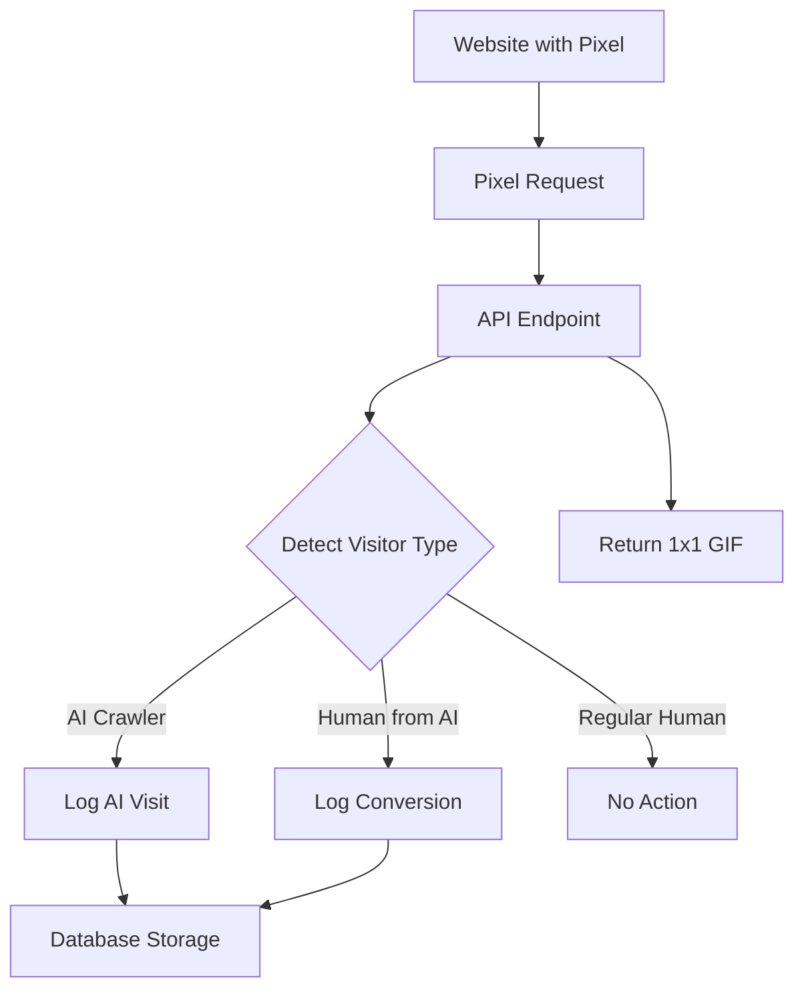

# Tracking Pixel Feature - Implementation Guide

## Overview

The Split.dev tracking pixel system enables seamless AI crawler detection and tracking across any website platform. This system provides a 1x1 invisible pixel that automatically detects and logs AI crawler visits (GPTBot, ClaudeBot, PerplexityBot, etc.) and tracks AI-to-human conversions.

## Key Features

### 🤖 AI Crawler Detection
- **25+ AI Crawlers Supported**: GPTBot, ClaudeBot, PerplexityBot, Google-Extended, Bingbot, and more
- **Real-time Detection**: Instant identification and logging of AI crawler visits
- **Detailed Analytics**: Track crawler company, category, and behavior patterns

### 🏆 AI-to-Human Conversion Tracking
- **Gold Mine Detection**: Identifies when humans visit your site after AI platforms reference it
- **Platform Attribution**: Tracks conversions from ChatGPT, Claude.ai, Perplexity.ai, and more
- **Conversion Analytics**: Measures the value of AI crawler indexing

### 🌐 Universal Platform Support
- **Any Website Platform**: Works with Framer, Webflow, WordPress, Shopify, and any HTML site
- **No Code Changes**: Simple HTML snippet integration
- **Cross-Origin Compatible**: CORS-enabled for seamless embedding

## Implementation Architecture

### Components

1. **Frontend UI**: `src/components/dashboard/tracking-pixel-setup.tsx`
2. **API Endpoint**: `src/app/api/track/[workspaceId]/pixel.gif/route.ts`
3. **Settings Integration**: `src/app/settings/page.tsx`
4. **Database**: Uses existing `crawler_visits` table

### Technical Flow



## Setup Guide

### 1. Access Tracking Pixel Setup

1. Navigate to **Settings** in your Split.dev dashboard
2. Click on the **Tracking Pixel** tab
3. Select your workspace if not already selected

### 2. Basic Setup

The quickest way to get started:

1. Copy the basic tracking code from the **Basic Setup** tab
2. Paste it into your website's `<head>` section
3. Test the pixel using the **Test Pixel** button

**Basic Code Example:**
```html

```

### 3. Platform-Specific Instructions

#### Framer
1. Open your Framer project
2. Click Settings (⚙️) → Site Settings
3. Navigate to the "Custom Code" section
4. Use one of these two options:

**Option 1: JavaScript Implementation (Recommended for <head>)**
```javascript
<script>
  (function() {
    var img = new Image();
    img.src = 'https://split.dev/api/track/YOUR_WORKSPACE_ID/pixel.gif';
    img.style.display = 'none';
    img.width = 1;
    img.height = 1;
    img.alt = '';
    // Ensure the image completes loading
    img.onload = function() { /* Pixel loaded successfully */ };
    img.onerror = function() { /* Pixel failed to load */ };
    // Append to body to ensure it loads
    document.body.appendChild(img);
  })();
</script>
```
- Paste this in the "Start of <head> tag" field

**Option 2: HTML Implementation (For <body>)**
```html

```
- Paste this in the "End of <body> tag" field

5. Publish your site

#### Webflow
1. Go to **Site Settings** → **Custom Code**
2. Choose one of these options:

**Option 1: HTML Implementation (Recommended)**
```html

```
- Paste this in the "Head Code" section

**Option 2: JavaScript Implementation**
```javascript
<script>
  (function() {
    var img = new Image();
    img.src = 'https://split.dev/api/track/YOUR_WORKSPACE_ID/pixel.gif';
    img.style.display = 'none';
    img.width = 1;
    img.height = 1;
    img.alt = '';
    // Ensure the image completes loading
    img.onload = function() { /* Pixel loaded successfully */ };
    img.onerror = function() { /* Pixel failed to load */ };
    // Append to body to ensure it loads
    document.body.appendChild(img);
  })();
</script>
```
- Also paste this in the "Head Code" section

3. **Publish** your site

#### WordPress
1. Appearance → Theme Editor → header.php
2. Paste before `</head>` tag
3. Or use "Header and Footer Scripts" plugin

#### HTML/Static Sites
1. Open HTML files
2. Paste in `<head>` section
3. Repeat for all tracked pages

#### Shopify
1. Online Store → Themes → Edit code
2. Open theme.liquid
3. Paste before `</head>`

#### Squarespace
1. Settings → Advanced → Code Injection
2. Paste in "Header" field
3. Save changes

### 4. Advanced Configuration

For advanced tracking needs:

1. Switch to the **Advanced** tab
2. Configure custom parameters:
   - **Custom URL**: Override auto-detected URL
   - **Page Name**: Add custom page identifiers
   - **Campaign**: Track specific campaigns or sources

**Advanced Code Example:**
```html

```

## What Gets Tracked

### AI Crawlers Detected

| Crawler | Company | Category |
|---------|---------|----------|
| GPTBot | OpenAI | AI Training |
| ChatGPT-User | OpenAI | AI Assistant |
| ClaudeBot | Anthropic | AI Training |
| Claude-Web | Anthropic | AI Assistant |
| PerplexityBot | Perplexity | AI Search |
| Google-Extended | Google | AI Training |
| Googlebot | Google | Search AI |
| Bingbot | Microsoft | Search AI |
| Meta-ExternalAgent | Meta | AI Training |
| YouBot | You.com | AI Search |
| Bytespider | ByteDance | AI Training |
| Amazonbot | Amazon | AI Assistant |
| LinkedInBot | LinkedIn | Social AI |
| Applebot-Extended | Apple | AI Training |
| CCBot | Common Crawl | AI Training |
| PetalBot | Petal Search | Search AI |
| YandexBot | Yandex | Search AI |
| DuckDuckBot | DuckDuckGo | Search AI |

### AI-to-Human Conversions

The system detects when humans visit your site after AI platforms:

- **ChatGPT** → Human visitor
- **Claude.ai** → Human visitor  
- **Perplexity.ai** → Human visitor
- **Google Gemini** → Human visitor
- **Bing Chat** → Human visitor
- **Microsoft Copilot** → Human visitor
- **You.com** → Human visitor

## Data Structure

### Crawler Visit Record

```typescript
interface CrawlerVisit {
  user_id: string
  workspace_id: string
  domain: string
  path: string
  crawler_name: string
  crawler_company: string
  crawler_category: string
  user_agent: string
  timestamp: string
  status_code: number
  response_time_ms: number | null
  country: string | null
  metadata: {
    source: 'tracking_pixel'
    page?: string
    campaign?: string
    referer?: string
    tracking_method: 'html_pixel'
    pixel_load_time: number
    request_id: string
    ip_address: string
    // Additional fields for conversions
    conversion_type?: 'ai_to_human'
    ai_platform?: string
    ai_source_company?: string
    ai_category?: string
    is_conversion?: boolean
  }
}
```

### Conversion Events

AI-to-human conversions are stored with special metadata:

- `crawler_category`: `'ai-to-human-conversion'`
- `crawler_name`: `'ChatGPT → Human'` (example)
- `metadata.is_conversion`: `true`
- `metadata.conversion_type`: `'ai_to_human'`
- `metadata.ai_platform`: Source AI platform
- `metadata.ai_source_company`: Company behind the AI

## API Reference

### Pixel Endpoint

**GET** `/api/track/[workspaceId]/pixel.gif`

**Parameters:**
- `url` (optional): Override detected URL
- `page` (optional): Custom page identifier
- `c` (optional): Campaign identifier

**Response:**
- Returns 1x1 transparent GIF
- Status: 200 OK
- Content-Type: image/gif
- CORS enabled for cross-origin requests

**Headers Set:**
```
Content-Type: image/gif
Cache-Control: no-cache, no-store, must-revalidate
Pragma: no-cache
Expires: 0
Access-Control-Allow-Origin: *
```

## Testing and Validation

### Test Pixel Functionality

1. Use the **Test Pixel** button in the dashboard
2. Check browser network tab for successful pixel load
3. Verify test events appear in your crawler visits data

### Manual Testing

```javascript
// Test pixel in browser console
const testImg = new Image();
testImg.onload = () => console.log('Pixel loaded successfully');
testImg.onerror = () => console.log('Pixel failed to load');
testImg.src = 'YOUR_PIXEL_URL_HERE';
// Append to body to ensure it loads
document.body.appendChild(testImg);
```

### Validation Checklist

- [ ] Pixel loads without affecting page appearance
- [ ] CORS headers allow cross-origin requests
- [ ] AI crawler visits are logged correctly
- [ ] Human visits from AI platforms trigger conversions
- [ ] Custom parameters are captured in metadata
- [ ] No JavaScript errors in browser console
- [ ] Fast response times (<200ms typical)

## Performance Considerations

### Optimization Features

- **Non-blocking Database Writes**: Pixel response isn't delayed by database operations
- **Lightweight Response**: Minimal 43-byte GIF response
- **Edge Optimization**: Works with CDN and edge networks
- **Error Resilience**: Always returns pixel even on errors

### Best Practices

1. **Place in `<head>`**: Ensures early execution
2. **No JavaScript Dependencies**: Pure HTML implementation
3. **Async Database Operations**: Don't block pixel response
4. **Graceful Error Handling**: Continue serving pixel on failures

## Troubleshooting

### Common Issues

**Pixel Not Loading**
- Check CORS settings
- Verify workspace ID is correct
- Ensure no ad blockers are interfering

**No Data Appearing**
- Confirm workspace permissions
- Check database connectivity
- Verify Supabase service role key

**Slow Performance**
- Database operations are async and shouldn't affect speed
- Check for network connectivity issues
- Monitor API response times

### Debug Information

The API includes comprehensive logging:

```
[Tracking Pixel ABC123] 🔥 INCOMING REQUEST
[Tracking Pixel ABC123] 🤖 AI Crawler detected: GPTBot
[Tracking Pixel ABC123] ✅ Successfully tracked GPTBot visit
```

**Conversion Detection:**
```
[Tracking Pixel ABC123] 🏆 HUMAN FROM AI DETECTED: ChatGPT
[Tracking Pixel ABC123] 🎉 Successfully tracked AI-to-Human conversion
```

## Security and Privacy

### Data Protection

- **No Personal Information**: Only technical data is collected
- **IP Address Handling**: Stored for analytics but can be anonymized
- **GDPR Compliance**: Minimal data collection approach
- **User Agent Logging**: Required for crawler detection

### Access Control

- **Workspace Isolation**: Data is scoped to specific workspaces
- **RLS (Row Level Security)**: Database-level access controls
- **Service Role Authentication**: Secure server-side operations

## Analytics and Insights

### Available Metrics

1. **AI Crawler Visits**
   - Count by crawler type
   - Time-based analysis
   - Domain and page breakdowns

2. **AI-to-Human Conversions** (🏆 Gold Mine!)
   - Conversion rate by AI platform
   - Attribution tracking
   - Revenue impact measurement

3. **Platform Performance**
   - Response times
   - Error rates
   - Geographic distribution

### Dashboard Integration

The tracking pixel data integrates with your existing Split.dev dashboard:

- Crawler visit charts and trends
- Conversion funnel analysis  
- AI platform attribution reports
- Real-time monitoring alerts

## Advanced Use Cases

### Campaign Tracking

Track different campaigns or traffic sources:

```html
<!-- Summer campaign -->


<!-- Newsletter traffic -->

```

### A/B Testing Integration

Use page parameters to track different versions:

```html
<!-- Version A -->


<!-- Version B -->  

```

### Multi-Domain Tracking

Track across multiple domains with the same workspace:

```html
<!-- Domain 1 -->


<!-- Domain 2 -->

```

## Deployment Checklist

### Pre-Deployment

- [ ] Test tracking pixel in development environment
- [ ] Verify database schema supports all required fields
- [ ] Confirm Supabase service role key is configured
- [ ] Test CORS functionality across target domains

### Post-Deployment

- [ ] Deploy tracking pixel to production websites
- [ ] Monitor initial tracking data for accuracy
- [ ] Set up alerts for tracking failures
- [ ] Document rollback procedures if needed
- [ ] Train team on new analytics capabilities

### Monitoring

- [ ] Set up tracking pixel uptime monitoring
- [ ] Monitor database performance impact
- [ ] Track API response times and error rates
- [ ] Monitor conversion detection accuracy

## Future Enhancements

### Planned Features

1. **Real-time Notifications**: Instant alerts for high-value conversions
2. **Advanced Attribution**: Multi-touch attribution modeling
3. **Heatmap Integration**: Visual representation of AI crawler activity
4. **API Webhooks**: Real-time data export to external systems
5. **Enhanced Geolocation**: Country/region-based analytics
6. **Custom Crawler Rules**: User-defined crawler detection patterns

### Integration Opportunities

- **Google Analytics**: Export conversion data
- **Slack/Discord**: Real-time conversion notifications  
- **CRM Systems**: Lead attribution tracking
- **Email Marketing**: AI-driven segmentation
- **Revenue Analytics**: ROI measurement tools

## Support and Resources

### Getting Help

- **Documentation**: This guide and API reference
- **Dashboard Testing**: Built-in pixel testing tools
- **Support Team**: Available for implementation assistance
- **Community**: Share experiences and best practices

### Additional Resources

- [API Documentation](../api/tracking-pixel.md)
- [Platform Integration Guides](../guides/platform-integrations.md)
- [Troubleshooting Guide](../troubleshooting/tracking-pixel.md)
- [Analytics Dashboard Guide](../guides/analytics-dashboard.md)

---

**Last Updated**: December 2024  
**Version**: 1.0.0  
**Status**: Production Ready ✅ 